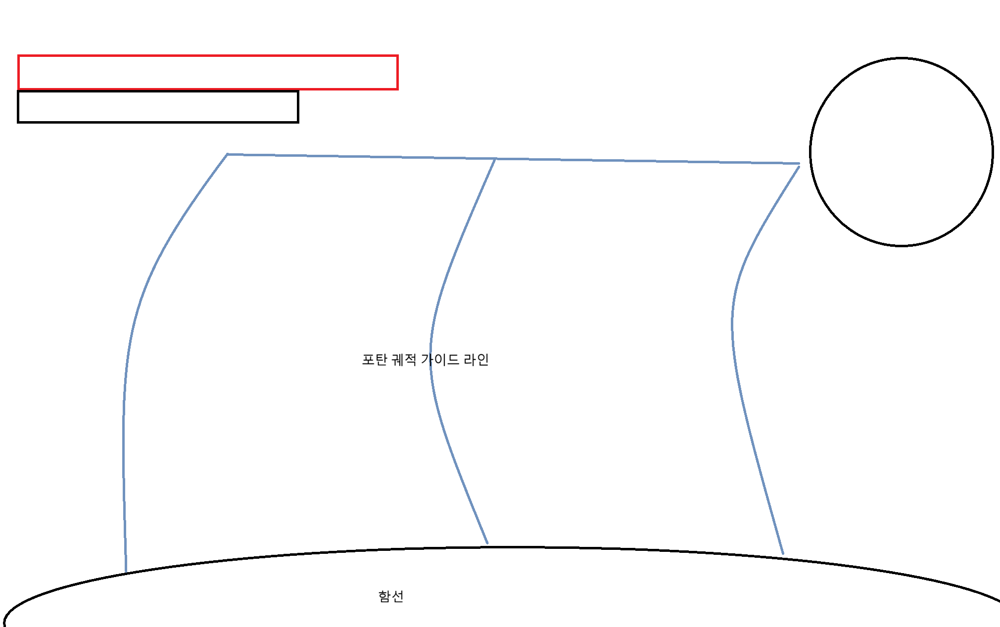
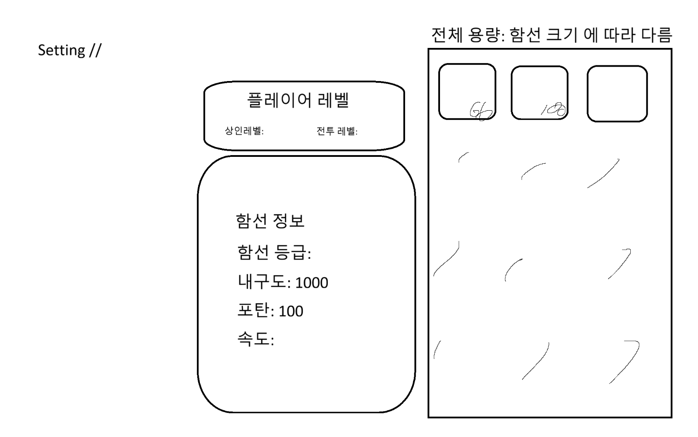
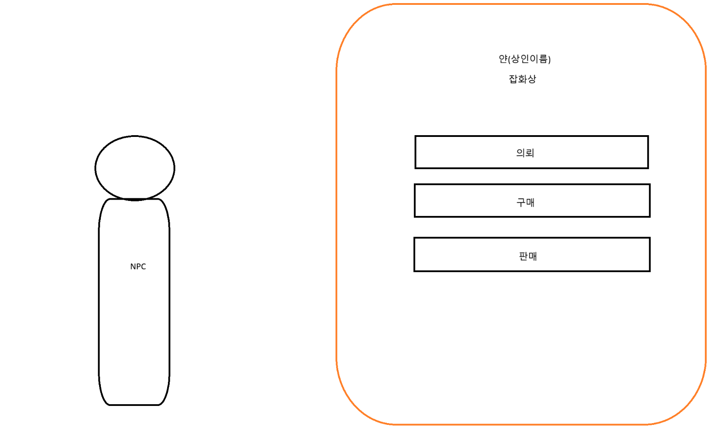
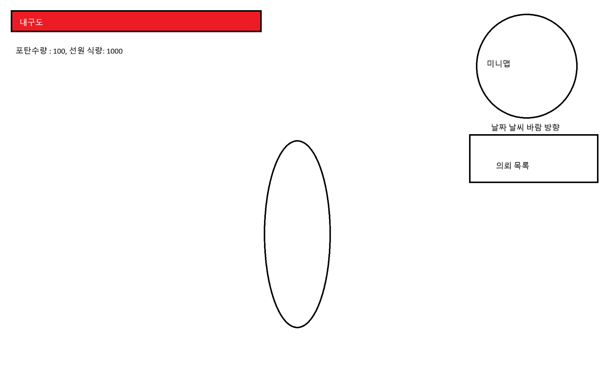
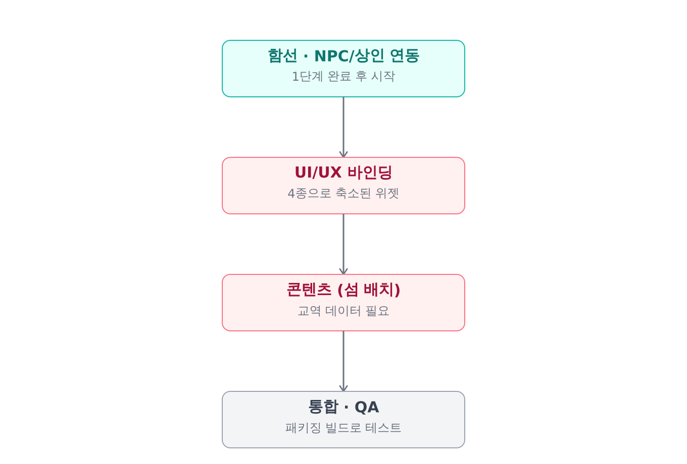
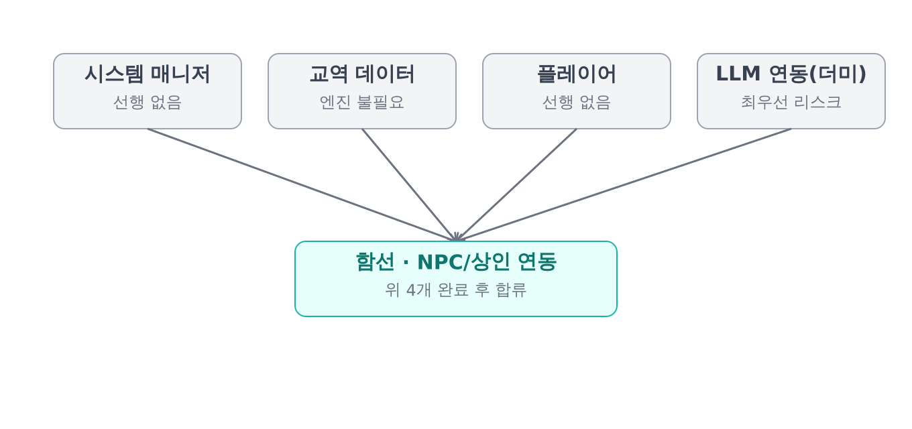
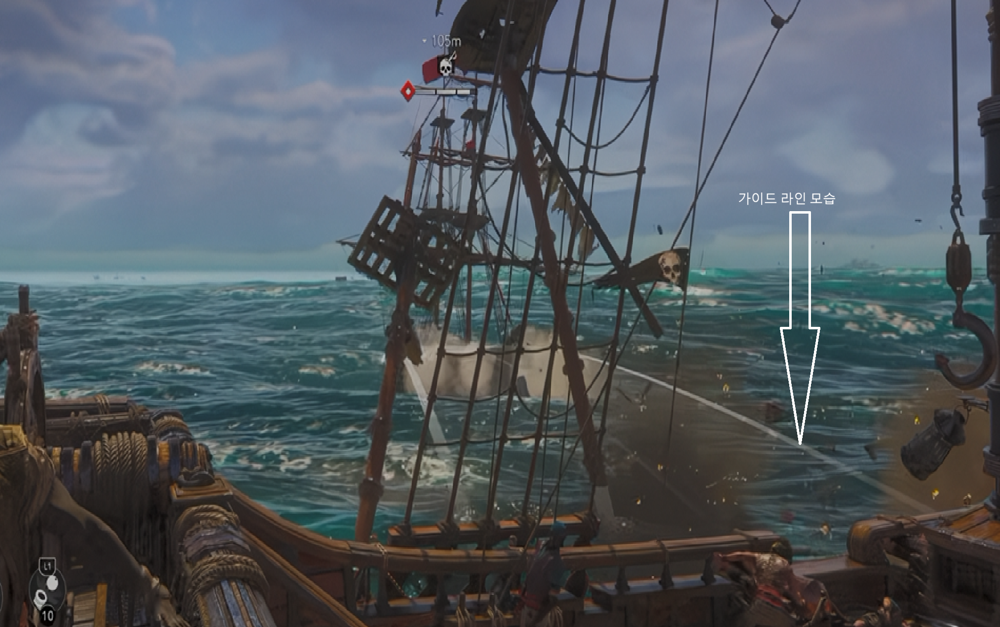
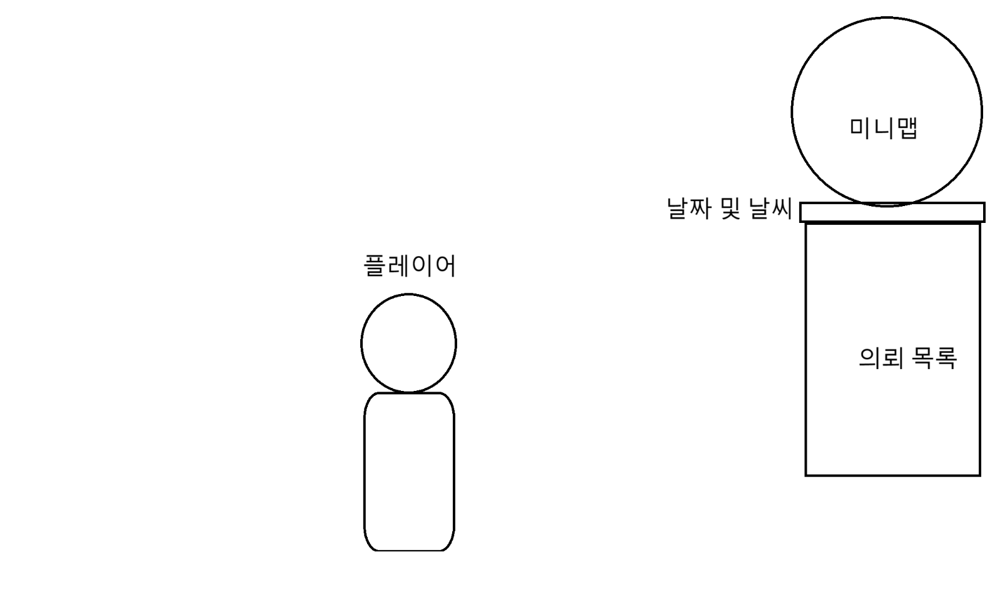

# 게임 상세 기획서 — Starizon Light

> 🟢 MVP 확정 　 🟡 스트레치 골 　 🔴 결정 필요 　 ⚪ 컷됨

## 1.  개요


| 게임명 | Starizon Light |
|---|---|
| 장르 | 심리스 무역 RPG (대항해시대 스타일) |
| 플랫폼 | PC (고사양 PC 권장, VRAM 11GB) |
| 핵심 컨셉 | 몰락한 귀족이 왕의 제안으로 미지를 개척하고, 자본과 무력으로 세계의 부를 독점하는 해상 제국 연대기 |
| 핵심 재미 요소 | 항해, 무역(도파민) |
| 타깃 유저 | 대항해시대 시리즈 / 어쌔신크리드 블랙플래그 등 해상 액션·탐험 유저층 |
| 핵심 차별점 | 로컬 LLM(llama.cpp) 기반 동적 NPC/퀘스트 — 상인 NPC의 실시간 재고 상태에 따라 매번 다른 퀘스트 생성. 외부 API 호출 없는 완전 로컬 구동. |


### 개발 범위 (MVP 정의)


| 개발 기간 | 2개월 (8주) |
|---|---|
| 개발 인원 | 5인 (프로그래머 2, 디자이너 3) |
| 핵심 시스템 (전부 구현) | 항해 · 전투 · 교역(최소 범위) · LLM 기반 동적 퀘스트 |
| 스트레치 골 | 섬 상태(전쟁/흉작) 시스템, 세력 간 시뮬레이션, 절차적 섬 생성, 교역품/상인 수 확장 |


> 우선순위 원칙: 핵심 4개는 단순하지만 완성된 수준으로, 스트레치 골은 켜고 끌 수 있는 모듈로 설계하여 시간 부족 시 제외 가능하게 함.


## 2.  핵심 게임 플레이 루프

- 무역으로 자원 및 재화 수집
- 정보를 얻기 — 별도 시스템 없이 LLM 퀘스트 텍스트에 자연스럽게 흡수   ⚪`컷`
- 리스크 관리 (선원들 식량, 물자, 해적 조우 위험)
- 차익 실현 및 재투자 (함선 업그레이드)
- 더 먼 구역 탐험

## 3.  주요 시스템 기획


### 3.1 조작 및 이동 시스템

- 플레이어 캐릭터: WASD 조작, 3인칭
- 함선: W(돛 최대) / S(돛 최소) / A,D(좌우 회전), 바람에 따라 속도 영향

### 3.2 전투 / 상호작용 시스템

- 플레이어 직접 육상 전투 없음
- 함선끼리만 전투: 체력 + 대포가 공격 수단
- 충각(ramming) 시스템   ⚪`컷`
- 함선 1종 등급만 우선 구현, 명중률은 거리 기반 단일 공식   🟢`MVP 확정`
- 전투 목적은 "격침"보다 "이탈/도주 유도" 비중을 높여 콘텐츠 제작 부담 축소   🟢`MVP 확정`
- 침몰 후 처리: 마지막으로 입항했던 항구로 즉시 텔레포트 + 함선 체력 풀회복   🟢`MVP 확정`
- 침몰 패널티: 골드 20% 차감, 식량/포탄(소모성 자원)은 완전 손실(0으로 초기화). 교역 화물(인벤토리 아이템)은 유지 — 구현 단순화   🟢`MVP 확정`

| 항목 | 수치(초안) | 비고 |
|---|---|---|
| 함선 최대 체력 | 600 | 1종 등급 기준 |
| 함포 1회 데미지 | 100 (고정) | 명중 시 6발 = 침몰 |
| 명중률 공식 | 90% − 0.25%×거리(m) | 하한 40%, 거리 기반 단일 공식 |
| 전투레벨 보정 | 레벨당 명중률 +1%p (상한 +20%p) | 함포 정확도 상승 반영 |


> 플레이테스트 후 조정 가능한 초안 수치.


### 3.3 성장 / 경제 시스템

- 플레이어는 상인레벨 / 전투레벨 보유
- 상인레벨: 흥정 미니게임은 컷, 거래 성사 시 거래액 비례 경험치만 단순 지급   🟢`MVP 확정`
- 전투레벨: 함선 격침 시 상승, 함포 정확도 증가

| 항목 | 수치(초안) | 비고 |
|---|---|---|
| 상인 경험치 | 거래액 1골드당 0.1exp | 흥정 미니게임 없이 단순 비례 |
| 전투 경험치 | 격침 1회당 50exp |  |
| 레벨업 임계치 | 100 × 현재 레벨 | 상인/전투 레벨 공통 공식 |


> 플레이테스트 후 조정 가능한 초안 수치.


### 3.4 교역 경제 구조

- 재고는 "섬 단위 풀"로 존재하지 않음 — 모든 재고는 섬 안의 개별 상인(NPC) 단위로만 존재. 가격은 상인 개인 재고량 기반으로 개인별 산출.
- 교역품 종류 6~8종 / 섬 3~5개 직접 제작 / 상인 섬당 2~3명   🟢`MVP 확정`
- 상인 개인 인벤토리는 섬 전체 재고와 독립적으로 관리 (연동 로직 없음)
- 리필 정책: 게임 내 1일 단위 배경 계산, 실제 갱신은 입항 시점에 일괄 처리. 리필량 = 기본 생산량 × 경과 일수, 최대 재고 상한 존재.

| 항목 | 수치(초안) | 비고 |
|---|---|---|
| 기본 생산량 | 10 / 일 (전 품목 동일) | 품목별 차별화 없음 |
| 최대 재고 상한 | 70 (약 7일치) | 오래 안 가도 무한정 안 쌓임 |
| 가격 모델 | 기준가 ±10% 랜덤 | 수요/공급 시뮬은 스트레치 골(컷 아님, 후순위) |


> 플레이테스트 후 조정 가능한 초안 수치.

- 가격 시뮬레이션 공식, 섬 상태(전쟁/흉작/봉쇄), 교역품별 상태 민감도, 세력 간 시뮬레이션   🟡`스트레치 골`

## 4.  콘텐츠 및 데이터 구조

- 월드 구성: 메인 허브 섬 1개 + 교역 섬 2~3개, 총 3~4개 섬   🟢`MVP 확정`
- 절차적 섬 생성 — 모든 섬 직접 제작으로 대체   ⚪`컷`

### 4.1 UI/UX

- 플레이어 상태 화면: 미니맵, 의뢰 목록, 날짜 및 날씨 표시
- ESC 메뉴: 골드/자원은 인벤토리 아이템 형식으로 표시
- 함선 탑승 UI (미니맵은 임시, 중앙 하단 방위각으로 대체 가능성 있음)
- 함선 우클릭 → 함포 조준 화면
- NPC 상호작용: 콜리전 오버랩 진입 시 안내 UI 표시 → 버튼 입력 시 카메라 NPC 줌인 후 대화 UI 생성 (라인트레이스 미사용)   🟢`MVP 확정`

### 4.2 UI 와이어프레임 (참고 이미지)


> 초기 와이어프레임에 적힌 내구도/포탄 수치는 초안 스케치 단계의 메모이며, 공식 수치는 3.2의 함선 체력 600 기준을 따름.



> 그림 1. 메인 HUD — 플레이어, 미니맵, 날짜·날씨, 의뢰 목록



> 그림 2. ESC 메뉴 — 플레이어 레벨(상인/전투), 함선 정보, 인벤토리 그리드



> 그림 3. 인게임 HUD 상세 — 내구도 바, 포탄/식량 수치, 미니맵, 의뢰 목록



> 그림 4. 함포 조준 화면 — 포탄 궤적 가이드 라인



> 그림 5. 궤적 가이드 라인 레퍼런스 (참고 게임 스크린샷)



> 그림 6. NPC 대화 UI — 상인 이름/업종, 의뢰·구매·판매 버튼


## 5.  LLM 기반 동적 퀘스트 시스템 (로컬, llama.cpp)


### 5.1 개요

- 상인 NPC는 개인 인벤토리(보유 교역품/수량)를 보유하며, 이 상태를 기반으로 LLM이 해당 상인의 퀘스트를 동적으로 생성
- 로컬 추론 엔진: llama.cpp 기반, 외부 API 호출 없이 클라이언트 내에서 구동 (오프라인 플레이 가능, 비용 발생 없음)
- 메인 퀘스트(스토리)와 LLM 상인 퀘스트는 완전히 분리된 흐름: 메인 퀘스트는 작가가 직접 쓴 고정 대화로 강제 진행, LLM 퀘스트는 예/아니오 응답만 — 6.3 NPC/상인의 AMainQuestNPC와 AMerchantNPC로 클래스 자체가 분리됨   🟢`MVP 확정`

### 5.2 상인 인벤토리 ↔ 섬(거점) 재고의 관계

- (확정) 상인 개인 인벤토리는 섬 전체 재고와 독립적으로 관리됨. 상인 거래는 섬 단위 재고/가격에 영향 없음. 리필 로직은 "3.4 교역 경제 구조" 참조.

### 5.3 퀘스트 생성 트리거 및 캐싱 정책

- 입항 시점에 해당 항구 상인들의 퀘스트를 백그라운드로 선(先)생성하여 캐싱 (실시간 호출 대비 지연시간 체감 최소화)
- 임계치 기반 변화량 추적은 컷, 재입항할 때마다 그 시점 인벤토리로 무조건 재생성   🟢`MVP 확정`

### 5.4 퀘스트 생성 로직 (재고 상태 → 퀘스트 유형)

- 재고 과다 → 처분형 퀘스트: "이 자원을 사가 달라", 시세보다 낮은 가격 제시
- 재고 부족 → 조달형 퀘스트: "이 자원을 구해와 달라", 시세보다 높은 보상 제시

### 5.4.1 수락 / 잠금 / 해제 상태 흐름

- 상인과 대화 시 캐싱된 퀘스트를 "예/아니오" 형태로만 제안 — 협상·세부 조정 UI 없음 (구현 단순화)   🟢`MVP 확정`
- 예(수락) → 퀘스트 저장 및 잠금. 해당 상인은 퀘스트가 해결되거나 제한 시간이 지나기 전까지 새 퀘스트를 생성하지 않음 (LLM 재호출 비용도 같이 절약됨)   🟢`MVP 확정`
- 아니오(거절) → 잠금 없음, 다음에 다시 말을 걸면 그 시점 인벤토리 기준으로 새로 제안
- 해결 또는 제한 시간 초과 → 잠금 해제, 이후 재방문 시 다시 신규 제안 가능
- EQuestState { Proposed, Accepted, Completed, Expired } 4단계로 상태 관리 — FQuestData에 포함   🟢`MVP 확정`

### 5.5 LLM 입출력 스키마 (구조화된 출력 강제)

- 입력: 상인 ID, 상인 인벤토리(아이템ID-수량), 상인 성격 태그, 섬 시세 정보
- 출력: 고정 JSON 스키마 — { quest_text, quest_type(처분/조달), target_item_id, target_amount }. target_item_id는 실제 인벤토리 내 아이템으로만 제한 (자유 생성 금지)
- llama.cpp GBNF 문법 강제 샘플링으로 출력 형식을 제약, 파싱 실패/환각 원천 차단
- 예시 — 식량 재고가 부족한 상인에게 요청 시 입력/응답

```
// 입력 (게임 클라이언트 → llama-server)
{
  "merchant_id": "port1_merchant_02",
  "inventory": { "food": 3, "cloth": 45, "timber": 60 },
  "personality_tag": "근면한, 직설적인",
  "island_price_info": { "food": 12.5, "cloth": 8.0, "timber": 5.5 }
}
```


```
// 출력 (llama-server → 게임 클라이언트, GBNF로 강제된 형식)
{
  "quest_text": "식량이 다 떨어져서 큰일이오. 좀 구해다 줄 수 있겠소?",
  "quest_type": "fetch",
  "target_item_id": "food",
  "target_amount": 15
}
```

- food 재고(3)가 적어 조달형(fetch)이 선택됨, target_item_id는 실제 inventory에 있는 키(food)로만 한정됨 — 보상(reward) 필드는 응답에 없으며 5.6의 공식으로 별도 계산   🟢`MVP 확정`

### 5.6 보상 수치 분리 원칙

- LLM은 퀘스트 문장(텍스트)만 생성, 보상 수치는 산정하지 않음
- 보상 = 요구수량 × 현재시장가 × 난이도계수 (게임 로직이 계산 후 전달, LLM은 문장 포장만 수행)

### 5.7 로컬 모델 사양 (확정)


| 항목 | 내용 | 비고 |
|---|---|---|
| 모델 | Gemma 4B급 | 정확한 버전 표기는 추후 확인 |
| 양자화 | Q4_K_M | VRAM 11GB 환경, 렌더링과 동시 부담 고려 |
| 추론 방식 | llama.cpp 기반 llama-server, 비동기 HTTP | 1학기 검증 구조 유지 |


## 6.  구현 항목 및 역할 분담 (Unreal C++)


> 프로그래머 2인(A, B), 디자이너 3인(1, 2, 3) 기준. 클래스/인터페이스/컴포넌트/구조체 단위까지 쪼개서, 상속·구현 관계와 주요 멤버까지 명시함. 이 표가 곧 클래스 설계도이자 작업 티켓 목록 역할을 함.


### 6.1 플레이어


> 선행 조건: 없음 — 가장 먼저 착수 가능.


| 이름 | 종류 | 상속/구현 | 주요 멤버(변수/함수) | 완료 기준 | 난이도 | 담당 |
|---|---|---|---|---|---|---|
| IInteractable | Interface | — | OnInteract(AActor* Instigator) — NPC, 함선, 상자 등 상호작용 가능한 모든 액터가 구현. USphereComponent 콜리전을 보유해 오버랩으로 감지됨 | 콜리전 오버랩 진입 시 안내 UI가 뜨고, 버튼 입력 시 OnInteract 호출이 확인됨 | 중 | 프로그래머 A |
| APlayerCharacter | Class | ACharacter 상속, 없음(인터페이스 구현 없음) | USpringArmComponent* CameraArm; USphereComponent* InteractionDetector; AActor* CurrentInteractable; OnOverlapBegin()/OnOverlapEnd(); MoveForward()/MoveRight(); Interact(); BoardShip()/ExitShip() — 인벤토리/골드는 UInventorySubsystem 참조, 캐릭터에 직접 보관하지 않음 | 콜리전 범위 진입 시 CurrentInteractable이 설정되고, 버튼 입력 시 해당 대상의 OnInteract만 호출됨(라인트레이스 없음) | 중 | 프로그래머 A |
| UInventorySubsystem | Subsystem | UGameInstanceSubsystem 상속 | TArray<FItemSlot> Items; AddItem(FName ItemID, int32 Qty, bool bIsTradeGood); RemoveItem() → bool; GetItemCount(); GetTradeGoods(); GetAllItems(); SetAllItems() — gold도 ItemID="gold"인 FItemSlot으로 통일 관리, OnInventoryChanged 델리게이트로 UI 자동 갱신 [구현 완료 — 2026.07.05] | AddItem/RemoveItem 호출 시 목록이 갱신되고 GetItemCount가 정확한 수량을 반환함 | 중 | 김준희 |
| FItemSlot | Struct | — | FName ItemID; int32 Quantity; bool bIsTradeGood — false인 경우 거래 UI에 노출하지 않음. gold는 bIsTradeGood=false로 특수 아이템 처리, DataTable(FTradeGoodData)에는 포함하지 않음 [구현 완료 — 2026.07.05] | gold 아이템이 거래 UI에 표시되지 않고, AddItem/RemoveItem으로 수량이 정확히 관리됨 | 하 | 김준희 |


### 6.2 함선 — 이동/물리 (서민규) · 전투 (김준희)


> 선행 조건: UInventorySubsystem(골드) 초기화 필요 — 침몰 패널티가 UInventorySubsystem::GetItemCount("gold")를 참조함. Buoyancy/조작 로직 자체는 더미 값으로 독립 착수 가능. 같은 AShipPawn 클래스를 두 사람이 나눠 작업하므로, 이동 멤버와 전투 멤버를 분리해서 머지 충돌을 줄이는 것을 권장.


| 이름 | 종류 | 상속/구현 | 주요 멤버(변수/함수) | 완료 기준 | 난이도 | 담당 |
|---|---|---|---|---|---|---|
| AShipPawn (이동) | Class | APawn 상속, IInteractable 구현 | UBuoyancyComponent* Buoyancy; SetSailPower(); Turn(); ApplyWindModifier() | 돛 조절/회전 입력에 따라 함선이 이동하고 풍향에 따라 속도가 변함 | 상 | 서민규 |
| AShipPawn (전투 확장) | Class 확장 | IDamageable 구현 추가 | UCombatComponent* Combat; FireCannon() | 함포 발사 입력 시 FireCannon이 호출되고 명중 판정까지 1회 흐름으로 동작함 | 중 | 김준희 |
| ApplySinkingPenalty() | Function (AShipPawn 내부) | OnDestroyed()에서 호출 | GetItemCount("gold") × 0.2만큼 RemoveItem("gold"), 식량/포탄 RemoveItem으로 전량 초기화, 교역 화물은 유지 → LastPortID 항구로 텔레포트 | 체력 0 도달 시 골드 20% 차감→소모품 초기화→텔레포트가 1회 흐름으로 정확히 동작함 | 하 | 김준희 |
| IDamageable | Interface | — | TakeDamage(float Amount); OnDestroyed() | TakeDamage 호출 시 체력이 감소하고, 0 이하에서 OnDestroyed가 정확히 1회 호출됨 | 중 | 김준희 |
| UCombatComponent | Component | UActorComponent 상속 | float CurrentHealth; float MaxHealth; ApplyDamage(); CalculateHitChance(float Distance); GetAccuracyBonus(int32 CombatLevel) | 거리별 CalculateHitChance 반환값이 명중률 공식(90%−0.25%×거리)과 일치함 | 중 | 김준희 |
| ACannonballProjectile | Class | AActor 상속 | OnHit(AActor* OtherActor); float Damage | 발사 후 명중 시 OnHit이 호출되고 데미지(100)가 정확히 적용됨 | 중 | 김준희 |


### 6.3 NPC / 상인


> 선행 조건: 6.4의 FTradeGoodData(교역품 데이터) 정의 후 착수 권장 — 상인 인벤토리가 교역품 데이터를 참조함.


| 이름 | 종류 | 상속/구현 | 주요 멤버(변수/함수) | 완료 기준 | 난이도 | 담당 |
|---|---|---|---|---|---|---|
| ABaseNPC | Class | ACharacter 상속, IInteractable 구현 | USphereComponent* InteractionCollision; OnInteract() override → 대화 시작; ZoomToNPC() | 플레이어가 콜리전에 닿으면 안내 UI가 뜨고, 버튼 입력 시 대화 UI와 카메라 줌인이 시작됨 | 중 | 프로그래머 B |
| AMerchantNPC | Class | ABaseNPC 상속, IQuestGiver 구현 | FMerchantInventory Inventory; FName PersonalityTag; GetInventorySnapshot() | GetInventorySnapshot 호출 시 실제 보유 재고가 정확히 반환됨 | 중 | 프로그래머 B |
| IQuestGiver | Interface | — | GetCurrentQuest(); RequestNewQuest() | GetCurrentQuest 호출 시 캐싱된 퀘스트(또는 null)가 정확히 반환됨 | 중 | 프로그래머 B |
| FMerchantInventory | Struct | — | TMap<FName,int32> ItemStock; RefillOnArrival(int32 DaysElapsed) | RefillOnArrival 호출 시 경과일수×생산량만큼 증가, 최대재고(70) 초과하지 않음 | 중 | 프로그래머 B |
| AMainQuestNPC | Class | ABaseNPC 상속 (IQuestGiver 미구현 — LLM과 무관) | TArray<FDialogueLine> ScriptedLines; LoadDialogueFromJson(FString FilePath); PlayDialogueSequence() — 강제 진행, 스킵/선택지 없음 | JSON 파일 로드 시 ScriptedLines가 파일 순서 그대로 채워지고, 대화 시작 시 순서대로 출력되며 스킵 입력이 무시됨 | 중 | 프로그래머 B |
| FDialogueLine | Struct | — | FString SpeakerName; FString Text; (JSON에서 역직렬화, 작가가 직접 작성, LLM 미사용) | JSON의 speaker/text 필드가 SpeakerName/Text와 1:1로 매핑되어 대화창에 정확히 표시됨 | 하 | 손정제 |


### 6.4 교역 경제


> 선행 조건: 없음 — 6.1~6.8 중 가장 먼저 착수 가능. 다른 다수 시스템(6.3, 6.5, 6.6)이 이 데이터를 참조함.


| 이름 | 종류 | 상속/구현 | 주요 멤버(변수/함수) | 완료 기준 | 난이도 | 담당 |
|---|---|---|---|---|---|---|
| UTradeComponent | Component | UActorComponent 상속 (AMerchantNPC에 부착) | BuyItem(); SellItem(); CalculatePrice(); GrantTradeExp() — 거래 시 RemoveItem/AddItem("gold")으로 골드 증감, 별도 Gold 변수 없음 | 매수 시 gold가 차감되고 아이템이 증가, 매도 시 반대로 정확히 동작함 | 중 | 프로그래머 B |
| FTradeGoodData | Struct (DataTable Row) | FTableRowBase 상속 | FName ItemID; int32 BaseProduction; int32 MaxStock; float BasePrice | DataTable에서 품목별 생산량/최대재고/기준가가 정확히 로드됨 | 하 | 김하선 |


### 6.5 LLM 연동 (가장 리스크 높음 — 최우선 착수)


> 선행 조건: HTTP 클라이언트 자체는 더미 인벤토리로 독립 검증 가능(7장 1~2주차). 단, 실제 퀘스트 생성은 6.3의 AMerchantNPC/FMerchantInventory 완료 후 연동.


| 이름 | 종류 | 상속/구현 | 주요 멤버(변수/함수) | 완료 기준 | 난이도 | 담당 |
|---|---|---|---|---|---|---|
| ULlamaClientSubsystem | Subsystem | UGameInstanceSubsystem 상속 | RequestQuest(AMerchantNPC* Target); OnResponseReceived() (비동기 콜백) | 더미 인벤토리로 요청 시 비동기로 응답이 수신되고 메인 스레드가 멈추지 않음 | 상 | 프로그래머 B |
| FQuestData | Struct | — | FName QuestID; FString QuestText; EQuestType QuestType; EQuestState State; FName TargetItemID; int32 TargetAmount; float TimeLimit; TArray<FItemSlot> RewardItems; FName GiverMerchantID — 보상을 골드 단일 필드가 아닌 아이템 배열로 두어 향후 아이템 보상까지 확장 가능 [구현 완료 — 2026.07.05] | 역직렬화된 필드가 응답 JSON과 1:1로 일치함 | 중 | 김준희 |
| AcceptQuest() / DeclineQuest() | Function (AMerchantNPC 내부) | — | 예/아니오 응답 처리. 수락 시 State=Accepted로 잠금, 거절 시 잠금 없음 | 예 클릭 시 State가 Accepted로 바뀌고, 동일 상인 재대화 시 신규 퀘스트가 제안되지 않음 | 중 | 프로그래머 B |
| CheckQuestExpiry() | Function (AMerchantNPC 내부) | — | 제한 시간 초과 또는 해결 시 State=Expired/Completed로 전환, 잠금 해제 | 시간 초과/완료 시 State가 전환되고 다음 대화에서 신규 제안이 가능해짐 | 중 | 프로그래머 B |
| EQuestType | Enum | — | 처분형(Sell) / 조달형(Fetch) | UI에 처분형/조달형이 정확히 구분되어 표시됨 | 하 | 프로그래머 B |
| EQuestState | Enum | — | Proposed / Accepted / Completed / Expired | 4개 상태가 설계된 흐름대로 순서 있게 전환됨 | 하 | 프로그래머 B |
| UQuestCacheManager | Component / Subsystem | UActorComponent 또는 UWorldSubsystem 상속 | CacheQuestsForPort(); GetCachedQuest(); 입항 시 선생성 트리거 | 입항 시 해당 항구 상인들의 퀘스트가 미리 생성되어 대화 시 지연 없이 표시됨 | 중 | 프로그래머 B |
| BuildQuestRequestJson() / ParseQuestResponse() | Function (Subsystem 내부) | — | 게임상태→JSON 직렬화 / 응답 JSON→FQuestData 역직렬화 | GBNF로 강제된 JSON이 파싱 오류 없이 FQuestData로 변환됨 | 상 | 프로그래머 B |
| GBNF grammar 파일 (quest_schema.gbnf) | 설정 파일 | — | FQuestData 스키마를 강제하는 GBNF 규칙 정의 — JSON 파싱 코드와 1:1로 맞물려야 해서 김준희가 직접 작성 | llama-server 구동 시 정의된 필드 외 토큰이 생성되지 않음 | 중 | 김준희 |
| CalculateReward() | Function | — | 보상 = 요구수량 × 현재시장가 × 난이도계수 | 계산값이 퀘스트 보상으로 정확히 지급됨 | 하 | 프로그래머 B |


### 6.6 UI/UX (UMG Widget)


> 선행 조건: 레이아웃 자체는 더미 값으로 먼저 제작 가능(4.2 와이어프레임 기준). 데이터 바인딩은 각 위젯이 참조하는 6.1~6.5 항목 완료 후 연결.


| 이름                    | 종류                  | 상속/구현                                                    | 주요 멤버(변수/함수)                                                          | 완료 기준                                          | 난이도 | 담당  |
| --------------------- | ------------------- | -------------------------------------------------------- | --------------------------------------------------------------------- | ---------------------------------------------- | --- | --- |
| ULobbyWidget          | Widget (UserWidget) | UUserWidget 상속                                           | 시작하기 버튼 (Start=Continue 통합) → OnStartClicked()                        | 버튼 클릭 시 세이브 유무에 따라 로드/신규생성 분기가 정확히 호출됨         | 중   | 최민승 |
| UInteractPromptWidget | Widget              | UUserWidget 상속, APlayerCharacter::CurrentInteractable 참조 | 콜리전 오버랩 진입 시 "버튼: 상호작용" 표시, 벗어나면 숨김                                   | 콜리전 진입/이탈에 따라 프롬프트가 정확히 표시/숨김됨                 | 하   | 최민승 |
| UMainHUDWidget        | Widget (UserWidget) | UUserWidget 상속                                           | 미니맵, 날짜·날씨 표시 바인딩                                                     | 미니맵/날짜·날씨가 실시간 값으로 갱신되어 표시됨                    | 하   | 최민승 |
| UQuestSlotWidget      | Widget              | UUserWidget 상속                                           | 의뢰 칸 1개 — FQuestData 바인딩 (수락 후 진행중 표시, 잠금 아이콘 포함)                     | 퀘스트 수락 시 잠금 아이콘과 진행중 상태가 정확히 표시됨               | 중   | 최민승 |
| UQuestTrackerWidget   | Widget              | UUserWidget 상속, TArray<UQuestSlotWidget*> 보유             | 현재 진행 퀘스트 목록 갱신 RefreshList()                                         | 퀘스트 추가/완료 시 목록이 자동으로 갱신됨                       | 중   | 최민승 |
| UMainDialogueWidget   | Widget              | UUserWidget 상속                                           | 메인 퀘스트 강제 대화 — "계속" 버튼만, 스킵/선택지 없음. FDialogueLine 순차 바인딩              | "계속" 클릭으로만 다음 대사로 넘어가고 다른 입력은 무시됨              | 하   | 최민승 |
| UQuestProposalWidget  | Widget              | UUserWidget 상속                                           | LLM 상인 퀘스트 제안 — 예/아니오 버튼만. 예 클릭 시 AcceptQuest() 호출                    | 예/아니오 클릭이 각각 AcceptQuest/DeclineQuest를 정확히 호출함 | 하   | 최민승 |
| UTradeWidget          | Widget              | UUserWidget 상속, UTradeComponent 참조                       | 아이템 슬롯, 매수/매도 버튼 → BuyItem()/SellItem() 호출                            | 매수/매도 클릭 시 골드·인벤토리가 즉시 갱신되어 표시됨                | 중   | 최민승 |
| UCannonAimWidget      | Widget              | UUserWidget 상속                                           | 함포 조준 화면 (우클릭 시 전환)                                                   | 우클릭 시 조준 화면 전환과 궤적 가이드라인 표시가 확인됨               | 중   | 최민승 |
| UEscMenuWidget        | Widget              | UUserWidget 상속                                           | ESC 입력 시 토글 표시; 인벤토리 · 함선 정보 · 캐릭터 레벨 표시; 설정 버튼 → OnSettingsClicked() | ESC 입력 시 정보가 표시되고 설정 버튼이 정상 동작함                | 중   | 최민승 |
| USettingsWidget       | Widget              | UUserWidget 상속                                           | 게임 설정(해상도/음량 등) 항목; 세이브 데이터 초기화 버튼 → OnResetSaveClicked()             | 초기화 버튼 클릭 시 확인 팝업 후 세이브가 삭제되고 로비로 복귀함          | 중   | 최민승 |
| UHealthBarWidget      | Widget              | UUserWidget 상속, UCombatComponent 참조                      | 함선 머리 위 HP 바                                                          | 체력 변화가 실시간으로 바 길이에 반영됨                         | 하   | 최민승 |


### 6.7 시스템 매니저


> 선행 조건: 없음 — 6.1~6.6보다 먼저 착수 권장 (오히려 다른 시스템들이 이 항목들을 참조함).


| 이름 | 종류 | 상속/구현 | 주요 멤버(변수/함수) | 완료 기준 | 난이도 | 담당 |
|---|---|---|---|---|---|---|
| UStarizonGameInstance | Class | UGameInstance 상속 | int32 MerchantLevel; int32 MerchantExp; int32 CombatLevel; int32 CombatExp; TArray<FQuestData> ActiveQuests; FName LastPortID; AddMerchantExp(); AddCombatExp(); SetLastPort(); SaveToSlot(); LoadFromSlot() — 인벤토리는 UInventorySubsystem이 전담, GameInstance는 레벨/퀘스트/항구 데이터만 보관 [구현 완료 — 2026.07.05] | 씬 전환 후에도 인벤토리/레벨/퀘스트/LastPortID가 정확히 유지됨 | 중 | 김준희 |
| UWorldTimeSubsystem | Subsystem | UGameInstanceSubsystem 상속, FTickableGameObject | 1초=N분 배속 타이머, GetCurrentDay(), SetCurrentDay() (로드 복원용) [구현 완료 — 2026.07.05] | 1초 경과 시 게임 내 시간이 설정된 배속만큼 정확히 흐름 | 중 | 김준희 |
| USaveGameStarizon | Class | USaveGame 상속 | TArray<FItemSlot> Inventory; TArray<FQuestData> ActiveQuests; MerchantLevel/Exp; CombatLevel/Exp; LastPortID; CurrentGameDay — 자동저장 전용(수동 슬롯 없음) [구현 완료 — 2026.07.05] | 저장 후 재실행 시 동일한 위치/골드/인벤토리로 정확히 복원됨 | 중 | 김준희 |


> 자동저장 트리거 (단순화): 별도 타이머 시스템 없이 입항 이벤트에 저장 호출을 결합 — 입항할 때마다 자동저장. 기존 "입항 처리" 로직에 SaveGame() 호출 한 줄만 추가하면 됨.


### 6.8 콘텐츠


> 선행 조건: 6.4의 FTradeGoodData(교역품 데이터) 정의 후 착수 — 상인 배치 시 실제 데이터가 필요함.


| 구현 항목 | 형태 | 완료 기준 | 난이도 | 담당(제안) |
|---|---|---|---|---|
| 섬 3~4개 레벨 디자인 (허브 1 + 교역섬 2~3) | 콘텐츠 | 각 섬에 입항 가능한 항구 포인트와 상인 배치 공간이 마련됨 | 중 | 디자이너 3 |
| 상인 NPC 배치 및 PersonalityTag 데이터 입력 | 콘텐츠/데이터 | 섬당 2~3명의 상인이 배치되고 각각 PersonalityTag가 할당됨 | 하 | 디자이너 1, 3 |


> 프로그래머 B(LLM 연동)는 일정상 1~2주차에 가장 먼저 파이프라인 동작 여부를 검증해야 함 (전체 일정 중 최대 리스크 구간).


## 7.  개발 일정 (8주) — 실제 가용 인력 기준


> 전제: 김준희(UE 가능, Claude Code 적극 활용)와 서민규(UE 입문)만 엔진을 직접 다룸. 최민승·김하선은 엔진 비의존 콘텐츠 트랙. 손정제는 일정에 핵심 경로로 의존시키지 않음.


### 7.1 제작 순서 (의존성 기준)

- ① 6.7 시스템 매니저 — 다른 모든 시스템이 참조하므로 최우선
- ② 6.4 교역 데이터 (FTradeGoodData) — 최민승·김하선이 엔진 없이 즉시 시작 가능, 6.3/6.8이 이걸 기다림
- ③ 6.1 플레이어 — 이동/상호작용 기본 골격
- ④ 6.5 LLM 연동 (HTTP+더미데이터) — 가장 리스크 높아 더미값으로 최대한 빨리 착수, ②와 별개로 동시 진행 가능
- ⑤ 6.2 함선 이동(서민규, UE 입문이라 단순 버전부터) — 전투 관련(명중판정/함포/침몰처리)은 김준희가 같은 클래스에 확장 작업
- ⑥ 6.3 NPC/상인 — ②(교역 데이터)와 ④(LLM)가 끝나야 실연동 가능
- ⑦ 6.6 UI/UX (최민승 전담, 컴퓨터 복구로 엔진 작업 가능해짐) — ③⑤⑥에 종속
- ⑧ 6.8 콘텐츠 (섬 레벨 디자인) — ②가 끝나야 실제 데이터로 배치 가능
- ⑨ 통합 및 QA — 김하선이 패키징된 .exe로 테스트(에디터 구동 불필요), 최민승은 UI 버그 픽스로 합류


> 그림 7. 1단계 — 기반 시스템 병렬 착수 (①~④, 선행 의존성 없음)



> 그림 8. 2단계 — 함선/NPC 연동 이후 통합 순서 (⑤~⑨)


### 7.2 주차별 일정


| 주차  | 김준희                                                                           | 서민규                             | 최민승                                            | 김하선                                            | 손정제                          |
| --- | ----------------------------------------------------------------------------- | ------------------------------- | ---------------------------------------------- | ---------------------------------------------- | ---------------------------- |
| 1주차 | 6.7 시스템 매니저 + 6.1 플레이어 착수                                                     | 6.2 Buoyancy/이동 셋업              | UE 환경 재설정 + 4.2 와이어프레임 기준 6.6 위젯 레이아웃 더미 제작 착수 | 6.4 교역품 데이터 작성 (6~8종), NPC 성격 태그 텍스트<br><br>완료 | 8.4 챕터1 오프닝 대화 초안 작성 (왕의 대사) |
| 2주차 | 6.1 플레이어 착수 + 6.5 LLM 연동 착수(더미) + GBNF grammar 파일 작성 + 6.2 함선 전투(명중 50:50) 착수 | 6.2 함선 이동 튜닝 (풍향 보정값, 회전 가속 조정) | 6.6 UI 위젯 본격 제작 (더미 데이터 바인딩)                   | 교역 데이터 보강 (지속)<br><br>NPC 성격 태그 텍스트            | 대화 초안 다듬기 + 추가 대사 작성         |
| 3주차 | 6.5 GBNF JSON 파싱까지 파이프라인 완성 (가장 중요한 체크포인트) + 6.2 거리 기반 명중률/침몰 처리 적용           | 6.2 함선 이동 최종 다듬기 (회전/가속 밸런스)    | 6.6 UI 데이터 바인딩 시작 (가능한 부분부터)                   | 교역 데이터 마무리, 대화 최종본 JSON 변환 검수                  | (8.4 대화 작성 마감)               |
| 4주차 | 6.3 AMerchantNPC/FMerchantInventory 실연동                                       | 6.8 섬 레벨 디자인 착수 (1개)            | 6.6 나머지 위젯 제작                                  | 상인 PersonalityTag 전체 입력, UI 와이어프레임 보완          | (미완 시) DataTable 단순 수치 입력 보조 |
| 5주차 | 통합 준비 / 6.3 마무리 (UI 부담 없어져 여유 확보)                                             | 6.8 섬 2~3개 완성 + 상인 배치           | 6.6 위젯 실데이터 연동 마무리                             | DataTable 수치 입력 보조, 로비/자동저장 흐름 데이터 점검          | 동일 (DataTable 보조)            |
| 6주차 | 전체 통합                                                                         | 6.2/6.8 마무리 통합                  | UI 버그 픽스, 패키징 빌드(.exe) 보조                      | 패키징 빌드(.exe)로 QA 테스트 시작                        | .exe 빌드 QA 보조 (단순 체크리스트만)    |
| 7주차 | 통합 버그 픽스 (최대 병목 구간)                                                           | 콘텐츠 마감, 버그 픽스 보조                | UI 버그 픽스 지속                                    | .exe 빌드 QA 지속, 발견된 버그 보고                       | QA 보조 지속                     |
| 8주차 | 최종 버그 픽스, 발표 준비                                                               | 발표 준비 보조                        | 발표 준비 보조                                       | 최종 콘텐츠 점검                                      | 발표 자료 보조 (있으면)               |


> 손정제(D)는 8.4 메인 퀘스트 대화 작성을 전담 — 이 작업은 안 끝나도 다른 시스템 개발이 막히지 않는 비차단(non-blocking) 영역이라, 의욕 문제가 있어도 안전하게 배치 가능. 미완 시 김하선이 임시 텍스트로 빠르게 대체 가능.


> 체크포인트: 3주차에 6.5(LLM 파이프라인)가 "블로킹" 상태면 4주차 진입 전 즉시 범위 재조정. 이게 이번 일정에서 유일하게 전체를 멈출 수 있는 지점.


> 주의: 함선 전투(명중판정/함포/침몰처리)가 김준희에게 추가되면서 2~3주차에 LLM 연동과 겹침 — 5주차에 확보됐던 여유가 다시 줄어들 수 있음. 3주차 체크포인트에서 전투 부분이 늦어지면 우선순위를 6.5(LLM)에 두고 전투는 4주차로 미루는 것을 권장.


> 공통 원칙: 모든 시스템은 더미 데이터로 화면/동작을 먼저 검증한 뒤 실제 데이터로 교체.


## 8.  세계관 및 시나리오


> MVP 범위는 1챕터만 완성. 2~3챕터는 출시 후 확장(얼리 액세스 방식) 로드맵으로 분리 — 본 학기 평가 범위에는 포함하지 않음.


### 8.1 세계관

- 배경: 몰락한 귀족 가문 출신의 플레이어가, 왕의 제안으로 미지의 바다를 개척하며 자본과 무력으로 세력을 재건하는 해상 무역 연대기
- 핵심 갈등: 왕실의 후원과 경쟁 귀족·상단의 견제 사이에서, 플레이어가 자력으로 부와 명성을 쌓아야 하는 구조

### 8.2 챕터 1 구조 (MVP)


| 구간 | 내용 |
|---|---|
| 오프닝 | 왕의 제안 — AMainQuestNPC(왕)와의 강제 스크립트 대화. 허브 섬과 함선을 하사받고 항해 시작 |
| 전개 | 교역 섬 2~3개 탐험, 상인과의 거래·LLM 퀘스트 수행을 통해 자금 확보 |
| 종료 조건 | 누적 골드 일정 기준 달성 + 함선 1회 이상 업그레이드 → 챕터 1 종료, "다음 이야기에서 계속됩니다" 안내 |


> 종료 조건 수치는 초안 — 플레이테스트 후 조정 가능.


### 8.3 향후 챕터 로드맵 (본 학기 범위 제외)

- 챕터 2: 경쟁 귀족·상단과의 견제 심화, 세력 간 시뮬레이션 요소(4장 "향후 확장 계획"의 섬 상태 시스템과 연결)   🟡`스트레치 골`
- 챕터 3: 결말 분기 — 누적 골드/명성에 따라 결말 다변화 검토   🟡`스트레치 골`

### 8.4 메인 퀘스트 대화 예시 (오프닝, AMainQuestNPC)

- 메인 퀘스트 대화는 C++ 하드코딩이 아니라 JSON 파일로 외부화 — 작가/디자이너가 재컴파일 없이 텍스트만 수정 가능. LLM 퀘스트 시스템과 동일하게 JSON을 데이터 포맷으로 통일   🟢`MVP 확정`
- AMainQuestNPC::LoadDialogueFromJson()가 파일을 읽어 TArray<FDialogueLine>으로 역직렬화, 이후 LLM 응답 파싱(5.5)과 동일한 JSON 파싱 유틸리티를 재사용

```
// Content/Dialogue/Chapter1_Opening.json
{
  "quest_id": "chapter1_opening",
  "lines": [
    { "speaker": "왕", "text": "귀하의 가문이 한때 이 바다를 호령했다는 것을, 짐은 잊지 않았다." },
    { "speaker": "왕", "text": "그대에게 배 한 척과 이 섬을 내리겠다. 다시 한번, 그 이름을 증명해보라." }
  ],
  "on_complete": "spawn_hub_island"
}
```

- "on_complete" 필드는 대화 종료 후 호출할 이벤트 키 — UMainDialogueWidget의 "계속" 버튼이 마지막 줄에 도달하면 해당 키를 트리거(예: 허브 섬 스폰)
- 예시 2 — 첫 입항 시 선원장과의 대화 (다른 화자, 다른 on_complete 키 사용)

```
// Content/Dialogue/Chapter1_FirstPort.json
{
  "quest_id": "chapter1_first_port",
  "lines": [
    { "speaker": "선원장", "text": "드디어 첫 항구입니다. 여기서 교역품을 사고팔 수 있습니다." },
    { "speaker": "선원장", "text": "상인들에게 말을 걸어보십시오. 다들 원하는 게 있을 겁니다." }
  ],
  "on_complete": "unlock_trade_tutorial"
}
```

- 두 예시처럼 quest_id와 on_complete 키만 다르게 주면 동일한 LoadDialogueFromJson() 함수로 여러 장면을 재사용 가능 — 손정제는 새 장면 추가 시 이 형식을 그대로 복사해서 speaker/text/on_complete만 바꾸면 됨

| 이름 | 종류 | 상속/구현 | 주요 멤버(변수/함수) | 완료 기준 | 난이도 | 담당 |
|---|---|---|---|---|---|---|
| FDialogueLine #1 | 왕 | — | JSON "lines"[0] → SpeakerName/Text 역직렬화 | JSON 텍스트가 왜곡 없이 그대로 출력됨 | — | 손정제 |
| FDialogueLine #2 | 왕 | — | JSON "lines"[1] → SpeakerName/Text 역직렬화 | JSON 텍스트가 왜곡 없이 그대로 출력됨 | — | 손정제 |
| on_complete 처리 | Function (AMainQuestNPC 내부) | — | 마지막 대화 줄 "계속" 클릭 시 on_complete 키에 매핑된 이벤트 호출 | 허브 섬 스폰까지 자동 전환됨 | — | 프로그래머 B |


> 메인 퀘스트 대화는 전부 작가가 직접 작성하는 고정 텍스트이며 LLM을 사용하지 않음. 위 JSON 파일이 ScriptedLines 배열의 실제 소스가 됨.
